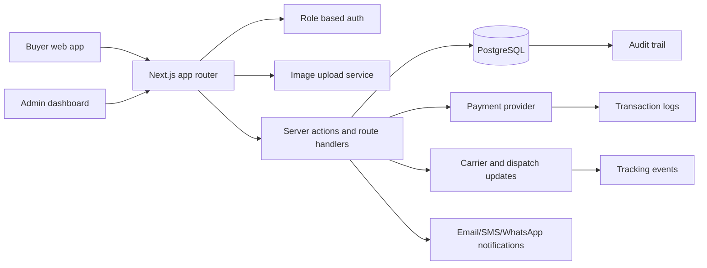

# System Architecture

## Product Scope

The platform connects Nigerian buyers with a trusted procurement operator working from Nasarawa State markets. Customers submit procurement requests with product reference images, receive quotations, pay securely, and track sourcing, quality checks, dispatch, logistics, delivery, disputes, transaction logs, and audit trails.

## High Level Architecture

## Core Services

- Web application: Next.js App Router pages for customer, admin, procurement, finance, logistics, and dispute workspaces.
- Authentication: NextAuth compatible credentials or OTP provider with role claims and account status checks.
- Authorization: route and action guards for customer, procurement officer, logistics officer, finance officer, dispute manager, admin, and super admin roles.
- Procurement: request intake, image references, market assignment, quotations, quality checks, and status transitions.
- Payments: quotation acceptance, payment initialization, payment webhook validation, transaction logs, and order release.
- Logistics: shipment creation, tracking code, carrier assignment, event timeline, delivery confirmation, and exception handling.
- Disputes: issue reporting, evidence review, operational notes, resolution, escalation, and closure.
- Market intelligence: Nasarawa market nodes, commodity availability, price movement notes, route risk, and confidence indicators.
- Trust verification: buyer profile checks, market officer assignment, supplier references, inspection evidence, and payment release control.
- Authenticated roles: customer, procurement officer, logistics officer, finance officer, dispute manager, admin, and super admin permissions are modeled separately.
- Procurement officer profiles: each officer has a market desk, language coverage, commodity specialties, supervisor, and verification note.
- Transport assignment: order release requires carrier, driver, vehicle, manifest, lane, route risk, and dispatch gate records.
- Proof of delivery: delivery completion requires recipient, timestamp, location note, signed evidence, and upload record.
- WhatsApp escalation: prefilled order context, operations triage, and audit-logged resolution decisions.
- Audit: immutable actor, action, entity, before/after, IP, and user-agent records for sensitive operations.

## Security Model

- Store password hashes only, never plaintext credentials.
- Use database transactions for payment capture, status changes, and audit inserts.
- Validate all public inputs with Zod schemas at route/action boundaries.
- Restrict uploads to images, scan content type, enforce file size, and store files outside the database.
- Keep payment webhooks idempotent by checking provider references before mutating orders.
- Write audit trails for role changes, quotations, payment events, status changes, dispute decisions, and exports.
- Treat WhatsApp as an escalation channel, not the source of truth. Every operational decision from WhatsApp must be written back to the order, transaction log, dispute record, or audit trail.
- Do not allow direct state jumps without required evidence. For example, `QUALITY_CHECK` cannot move to `READY_FOR_DISPATCH` without inspection evidence, and `IN_TRANSIT` cannot move to `DELIVERED` without proof of delivery.

## Regional Grounding

The prototype models Nasarawa operations around real trade areas including Lafia, Keffi, Akwanga, Nasarawa Eggon, and the Karu/Mararaba corridor. Each market node carries a role, common commodity focus, verification state, and intelligence signal so the product feels like a regional operating system rather than a generic order form.

## Deployment Shape

- App runtime: Next.js on Node.js hosting.
- Database: managed PostgreSQL with daily backups and point-in-time recovery.
- File storage: S3 compatible object storage for product reference images and dispute evidence.
- Jobs: queue worker or scheduled functions for notification retries, stale quotation expiry, SLA alerts, and audit export jobs.
- Observability: structured logs, request IDs, payment webhook logs, and admin activity metrics.
