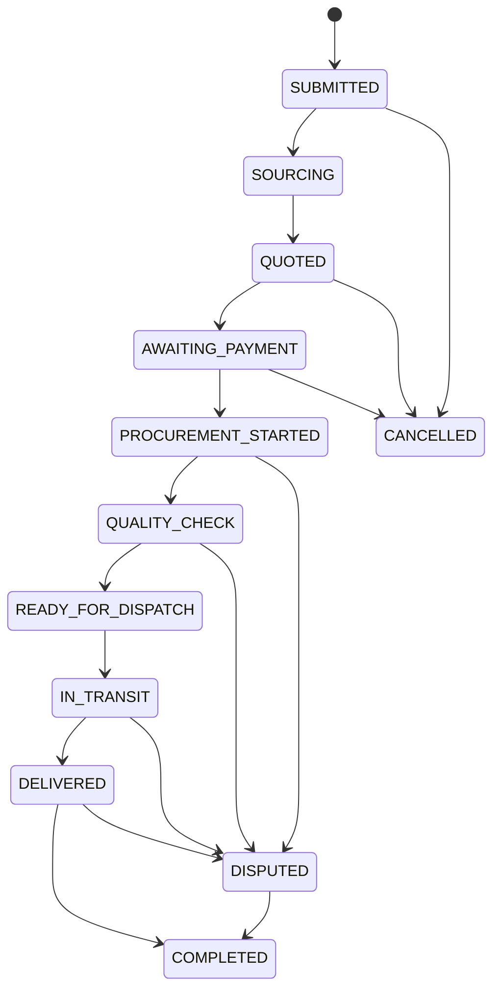

# Order Workflow Structure

## Customer Journey

1. Customer registers or signs in.
2. Customer creates a procurement request with product description, budget range, destination, and reference images.
3. Procurement officer reviews the request and sources products in Nasarawa markets.
4. Admin or procurement officer sends a quotation with product, service, logistics, and tax breakdown.
5. Customer accepts the quotation and pays through a secure payment provider.
6. Procurement begins after payment confirmation.
7. Procurement officer attaches inspection evidence such as count notes, reference image comparison, packaging photos, scale readings, and quality remarks.
8. Items pass quality check and are prepared for dispatch.
9. Logistics officer creates a shipment, assigns carrier and driver, records route risk, and updates transport checkpoints until delivery.
10. Customer confirms delivery or opens a dispute.
11. WhatsApp escalation can be used for urgent support, but the platform remains the source of truth.
12. Admin resolves disputes and closes the order with a full audit record.

## State Machine

## Role Ownership

- Customer: create request, upload reference images, accept quotations, pay, track, confirm delivery, open disputes.
- Procurement officer: verify request details, source goods, record market notes, update sourcing and quality status.
- Finance officer: review payment events, reconcile transactions, issue refunds when approved.
- Logistics officer: schedule pickup, assign carrier, create tracking updates, manage delivery exceptions.
- Dispute manager: review evidence, communicate with parties, propose resolution, escalate when needed.
- Admin: manage users, roles, quotations, workflow overrides, transaction logs, and audit trail exports.

## Operational Evidence

- Market intelligence: current market signal, commodity focus, availability, quote spread, and route note.
- Trust verification: buyer profile, supplier reference, assigned officer, payment release control.
- Inspection evidence: product photos, bag count, grading notes, sample comparison, package condition, reviewer name.
- Transport visibility: lane, vehicle, carrier, driver, checkpoint, ETA, route risk, and next action.
- WhatsApp escalation: prefilled order context, support triage, resolution decision, and audit record.

## Controlled State Transitions

The operational system should treat status changes as controlled events, not button labels. Every transition needs:

- An authenticated actor with the right role.
- Required evidence for that step.
- A before and after state.
- A transaction or audit log entry.
- A communication record when the customer, officer, carrier, or dispute desk is notified.

Examples:

- `AWAITING_PAYMENT` to `PROCUREMENT_STARTED` requires a verified payment provider reference.
- `QUALITY_CHECK` to `READY_FOR_DISPATCH` requires inspection evidence or customer variance approval.
- `READY_FOR_DISPATCH` to `IN_TRANSIT` requires a transport assignment.
- `IN_TRANSIT` to `DELIVERED` requires proof-of-delivery evidence.

## Required Audit Events

- Account registration and login.
- Role or account status change.
- Request submission and image upload.
- Quotation creation, update, acceptance, rejection, or expiry.
- Payment initialization, webhook receipt, capture, refund, or failure.
- Procurement status transition.
- Shipment creation and tracking update.
- Dispute status transition and resolution.
- Admin export of transaction or audit data.
